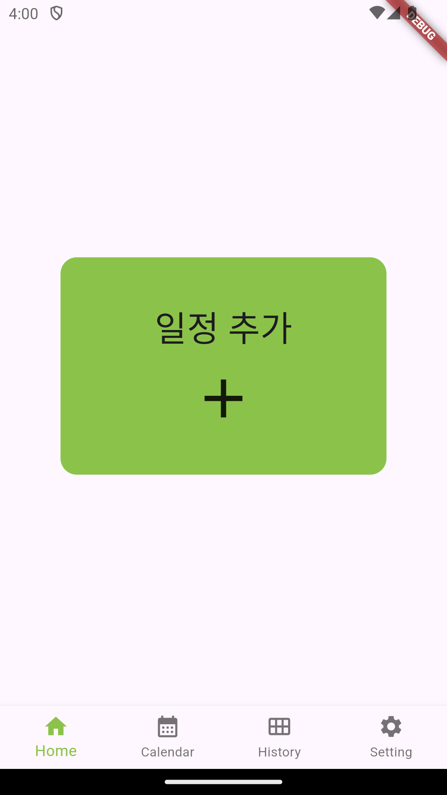
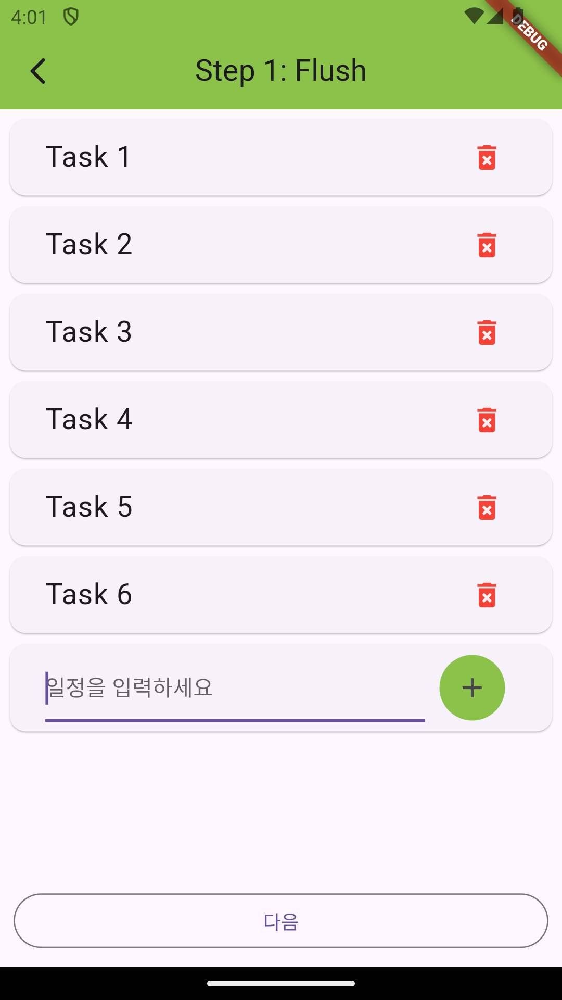
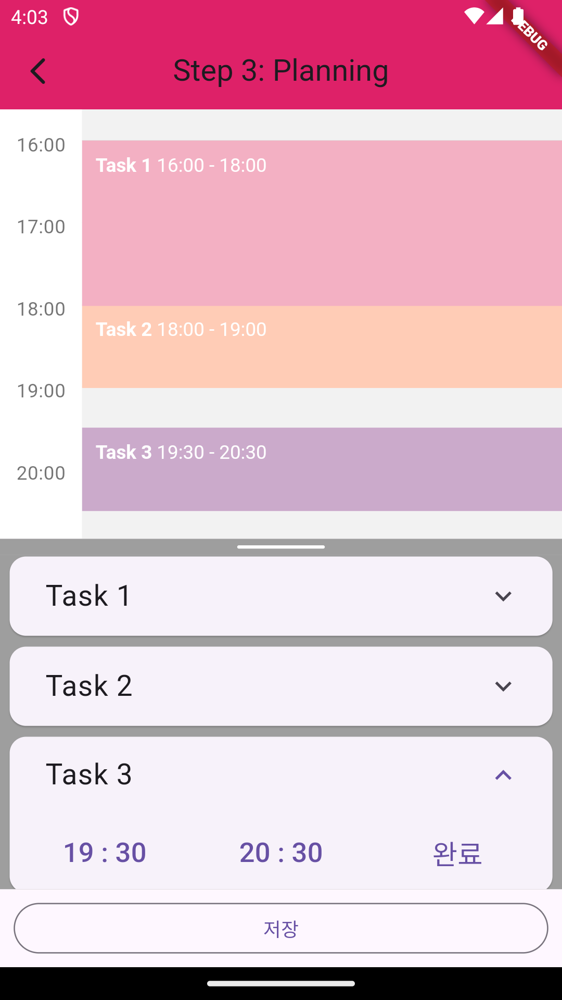
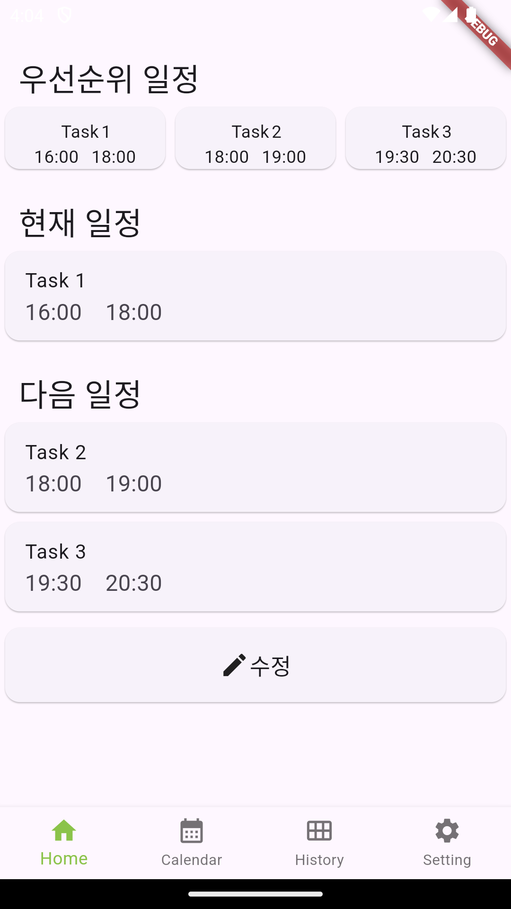
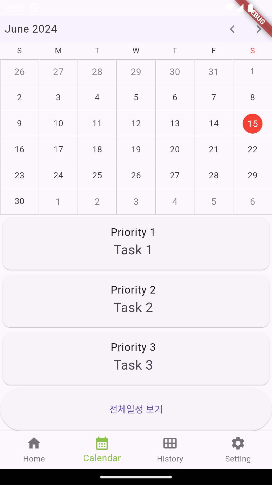
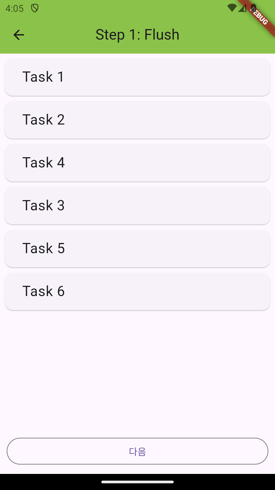
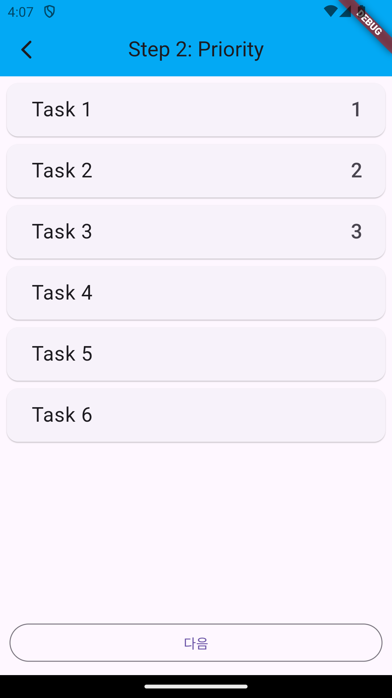
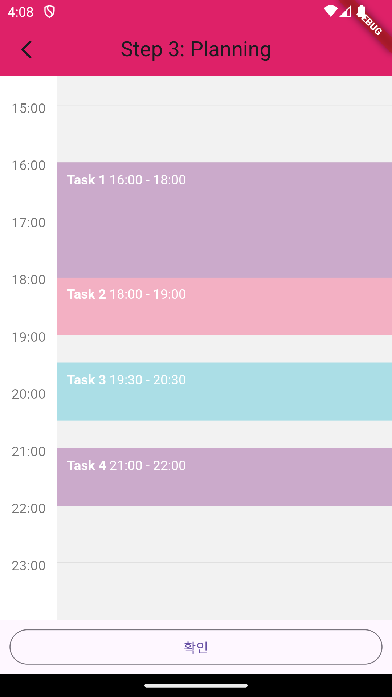
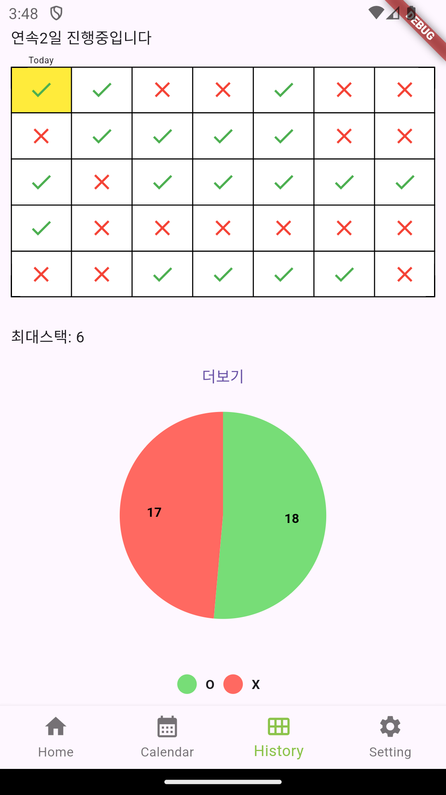
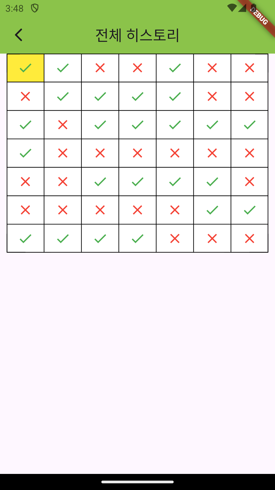

## 3Steps

---
TimeBoxing이론을 활용하여 하루계획을 스케쥴링하는 어플리케이션

### 실행화면

  <table>
    <tr>
        <td colspan ='5'>Home</td>
    <tr>
      <td></td>
      <td></td>
      <td></td>
      <td></td>
      <td></td>
    </tr>
  </table>

  <table>
    <tr>
        <td colspan ='4'>Calendar</td>
    <tr>
      <td></td>
      <td></td>
      <td></td>
      <td></td>
    </tr>
  </table>

  <table>
    <tr>
        <td colspan ='2'>History</td>
    <tr>
      <td></td>
      <td></td>
    </tr>
  </table>

### 사용기술
- Dart
- Flutter

### 사용 라이브러리
- SFCalendar
- flutter_week_view 
- Drift 

### 팀원소개
|[김민우](https://github.com/SP3cTRum-GH)|[정준수](https://github.com/kuper0201)|[조성환](https://github.com/0soi0)|
|:---:|:---:|:---:|
|CalendarView,UX/UI설계|HomeView,개발총괄|HistoryView,DB설계|

### TODO
- 위젯구현